# Trailer：AI 徒步行前攻略 Agent

面向中国徒步爱好者的一站式行前决策工具：读取用户已有的 KML 轨迹，自动完成路线量化分析、天气与周边信息搜集、交通方案整理，并通过 AI 生成可执行的行程、装备与安全攻略。


## 项目简介

徒步准备往往分散在轨迹 App、天气平台、地图搜索、交通查询和社区攻略中。用户不仅要反复切换工具，还需要自行判断路线强度、天气风险和补给条件。Trailer 将这些步骤收敛到一条可追踪的 Agent 工作流中，让“已有一条轨迹”能够继续转化为“可以用于行前决策的完整攻略”。

项目当前处于 **可运行 MVP** 阶段，核心链路已经打通：

- 上传 KML 后可解析轨迹、渲染地图与海拔剖面，并计算距离、爬升、耗时和风险等级；
- LangGraph Agent 可按输入情况选择天气、周边 POI、交通和攻略生成工具；
- 支持高德、Open-Meteo、OpenRouteService、SerpApi、聚合 MCP 和阿里云百炼等外部服务，并为关键链路提供降级方案；
- 前端通过 SSE 实时展示 Agent 执行过程，并在浏览器本地保存历史攻略；
- 当前自动化测试共 62 项，覆盖路线解析、路线分析、Agent 分支、服务降级和主要 API。

## 产品使用流程与页面展示

下面按照用户实际使用顺序，展示从上传轨迹到获得完整徒步攻略的主要流程。

### 1. 首页与历史攻略

用户进入网站后，可以上传新的 KML 轨迹，也可以从左侧历史列表恢复、收藏或清理此前生成的攻略。页面同时显示后端服务状态；“规划路线”前端入口目前仍标记为开发中，现阶段推荐以 KML 作为主要输入。

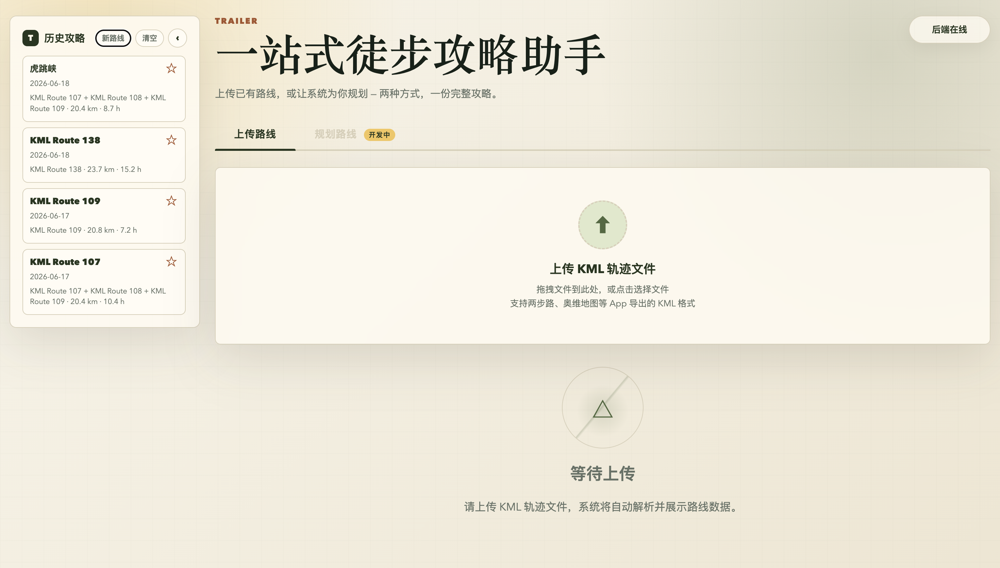

### 2. 解析轨迹与查看路线强度

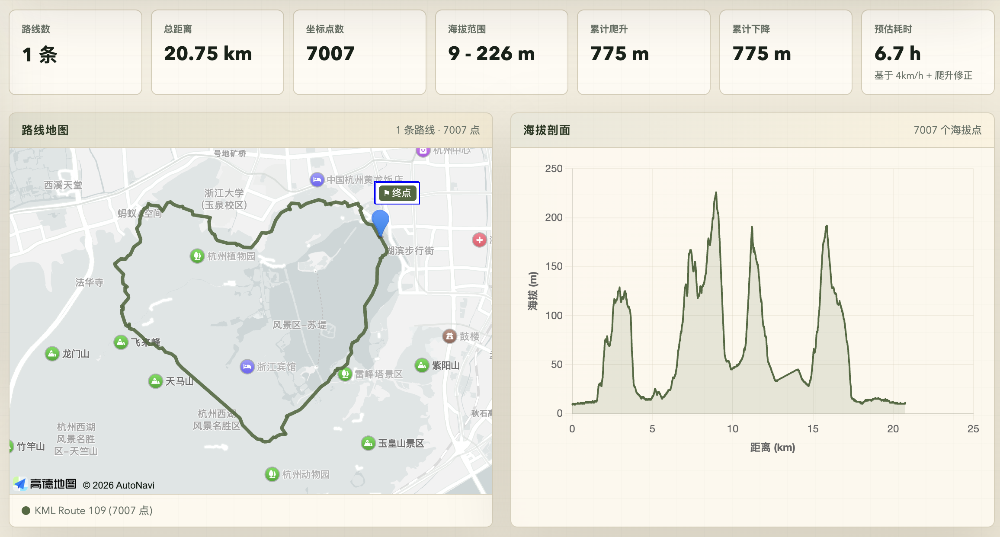

上传 KML 后，系统将轨迹解析为统一坐标模型，并在高德地图中绘制路线。页面同步展示坐标点数、总距离、海拔范围、累计爬升/下降与预计耗时，右侧海拔剖面用于快速识别连续爬坡和陡降路段。

### 3. 筛选适合出行的天气窗口

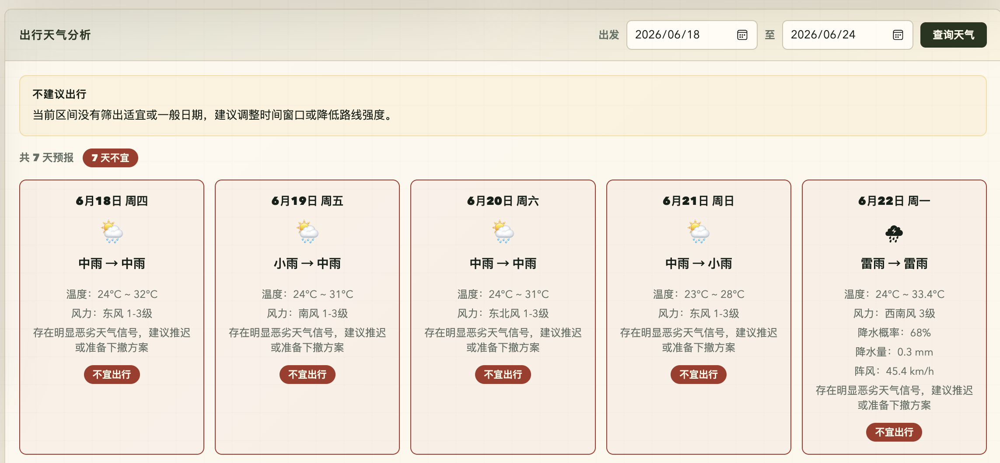

用户可以选择计划出发日期，查看逐日天气、温度、风力、降水和徒步适宜度。系统会汇总高德与 Open-Meteo 数据，并将雷雨、强降水和大风等天气直接标记为“不宜出行”，帮助用户在生成攻略前调整日期或路线强度。

### 4. 补充偏好并生成攻略

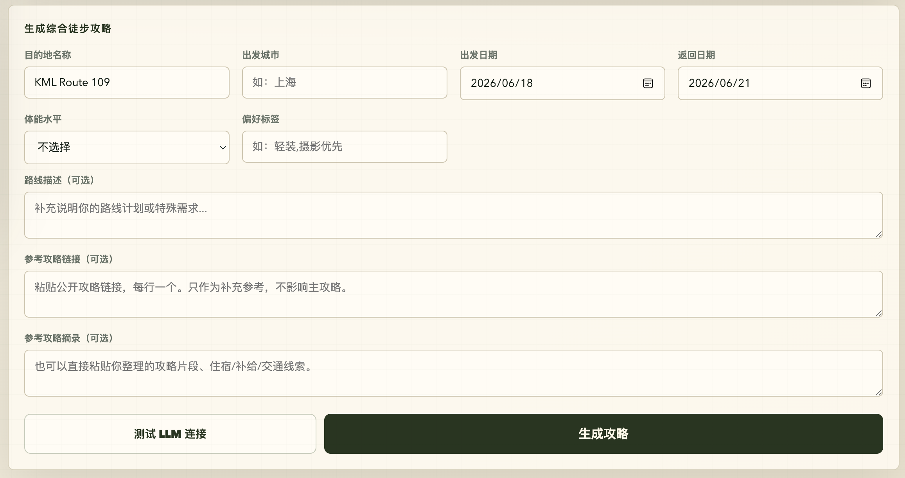

轨迹与天气确认后，用户填写目的地、出发城市、往返日期、体能水平和偏好标签，也可以补充路线说明、公开攻略链接或个人笔记。

### 5. 可视化 LLM 规划与工具调用

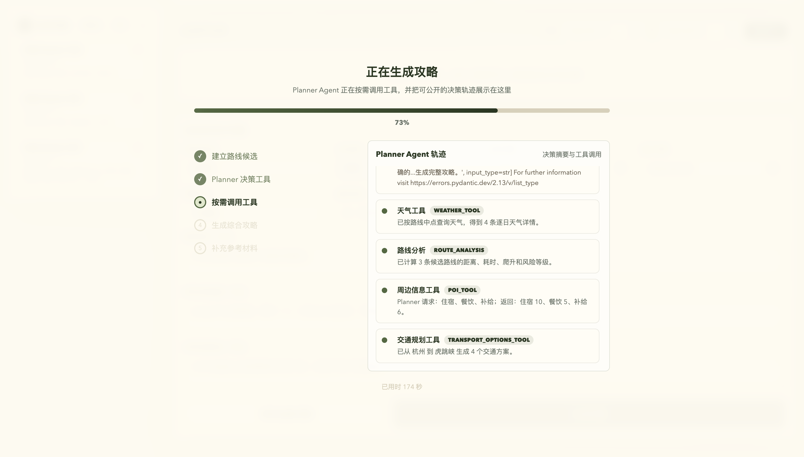

提交任务后，页面通过 SSE 实时展示 Planner Agent 的决策轨迹、当前阶段和整体进度。用户可以看到天气查询、路线分析、周边 POI 与交通规划等工具的调用结果，以及节点的完成、跳过或降级状态，避免将 LLM 处理过程隐藏在不可解释的长时间加载中。

### 6. 查看综合徒步攻略

Agent 将轨迹量化结果、天气、交通、周边服务与用户偏好整理为一份结构化攻略，而不是只返回一段难以执行的长文本。

#### 6.1 路线概览与多日行程

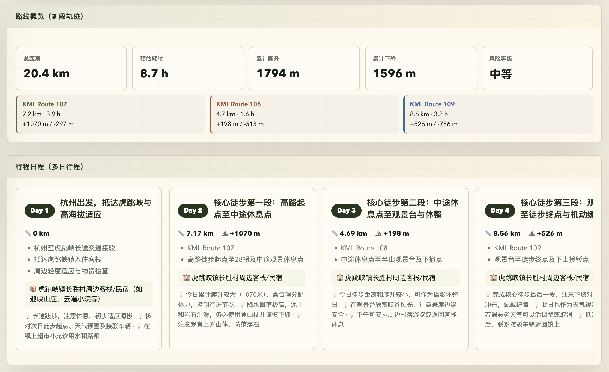

攻略首先汇总总距离、预计耗时、累计爬升/下降和风险等级，再按照多段 KML 与用户日期拆分每日行程。每天包含距离、爬升、住宿建议和注意事项，方便用户直接检查行程节奏是否合理。

#### 6.2 多方式交通方案

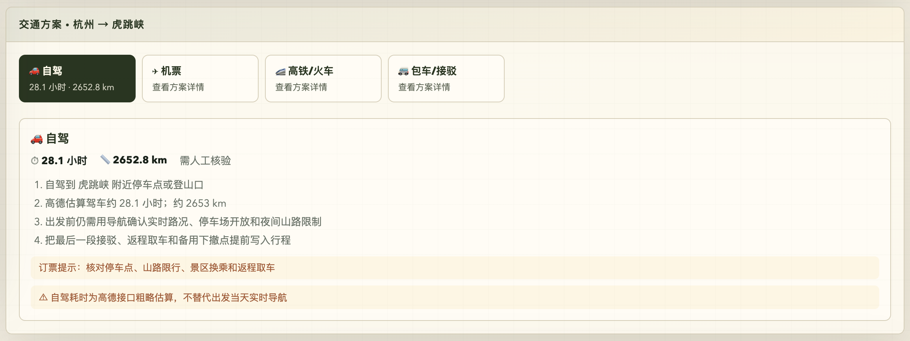

系统根据出发城市和路线目的地整理自驾、航班、高铁/火车及包车接驳方案。在线数据不足时，会明确标注“需人工核验”以及停车、限行、末班接驳和返程取车等检查项，不把粗略估算包装成实时导航。

#### 6.3 路线相关天气风险

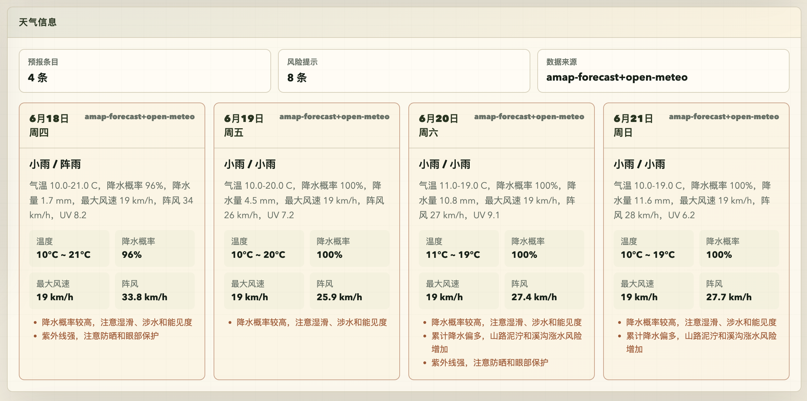

完整攻略保留逐日天气卡片，并将温度、降水概率、降水量、风速、阵风和 UV 指数转化为与徒步直接相关的风险提示，例如湿滑、涉水、能见度和防晒风险。

#### 6.4 住宿、餐饮与补给点

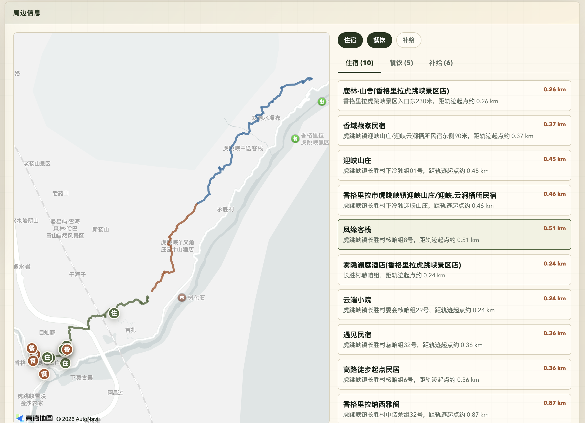

周边信息模块将路线与住宿、餐饮、补给 POI 放在同一张地图中，并按类型筛选、按距离展示候选地点。用户可以结合轨迹起点、终点和下撤方向规划住宿与补给，而不必在地图应用之间反复切换。

#### 6.5 可勾选装备清单

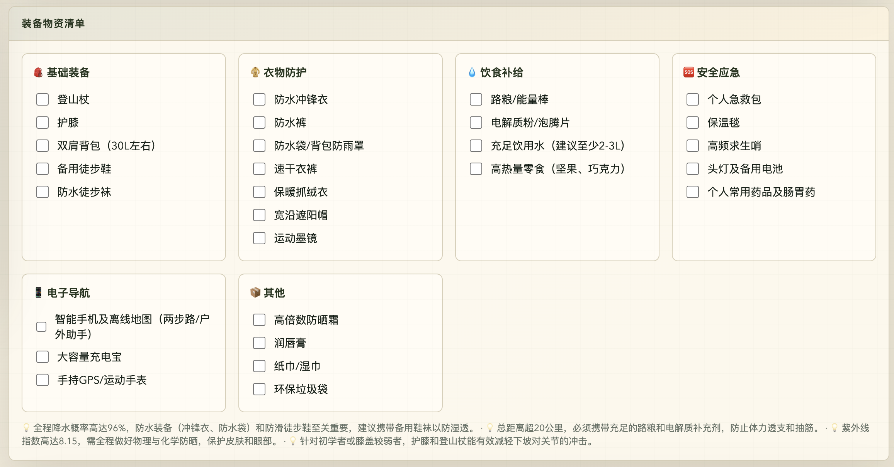

系统结合路线长度、天气和风险生成分类装备清单，覆盖基础装备、衣物防护、饮食补给、安全应急与电子导航。页面使用可勾选清单，便于出发前逐项确认，而不是只给出泛化建议。

#### 6.6 安全提醒与应急方案

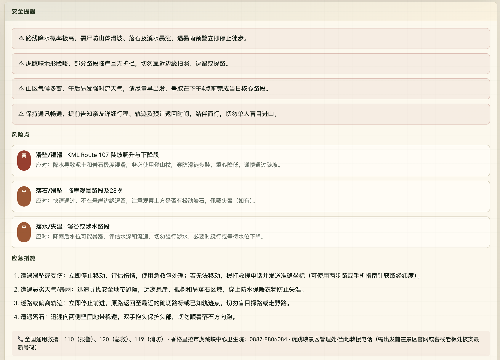

安全模块将天气与路线风险进一步拆为风险点、严重程度、应对方式和应急措施，并提醒用户核验救援电话、景区公告和实时预警。所有内容定位为行前辅助信息，不替代专业导航、官方通知或救援建议。

## 核心功能

- **KML 轨迹导入与预览**：支持 `LineString`、`gx:Track` 和多 `Placemark`，将两步路、奥维地图等工具导出的轨迹转换为统一路线模型。
- **路线强度与风险分析**：基于轨迹点计算总距离、累计爬升/下降、海拔区间和预计耗时，并结合距离、爬升、海拔及天气条件生成风险因子。
- **多日天气筛选**：高德负责近期中国区域天气，Open-Meteo 补齐更长日期范围；系统按降水、阵风、温度等条件标记适宜、一般和不宜日期。
- **周边行前信息搜集**：围绕路线采样点查询住宿、餐饮和补给 POI；外部服务不可用时返回明确的静态核验清单，而不是中断整条流程。
- **多方式交通规划**：根据出发城市、目的地和日期整理自驾、航班、铁路等候选方案；可选接入高德驾车、SerpApi 航班和聚合 MCP 票务查询。
- **AI 工具决策与攻略生成**：通过百炼通义千问判断本次任务需要调用哪些工具，再生成结构化的行程安排、装备清单、安全建议与补充说明。
- **参考攻略安全补充**：可读取用户提供的公开链接或笔记，将社区经验作为补充材料；参考内容不会覆盖主攻略结论，冲突信息会进入待核验项。
- **可视化与流式反馈**：单页前端展示地图轨迹、海拔图、天气卡片、POI、交通方案和攻略结果，并通过 SSE 实时呈现 Agent 节点状态与降级原因。
- **本地历史记录**：攻略结果保存在 `localStorage`，支持收藏、置顶、恢复和清空，无需后端账户即可回看本机生成记录。

## 技术栈

### Web 与前端

- FastAPI、Uvicorn
- 原生 HTML / CSS / JavaScript
- Server-Sent Events（SSE）流式响应
- 高德地图 JavaScript API
- Chart.js 海拔剖面图
- LocalStorage 本地历史记录

### Agent 与 AI

- LangGraph 状态图与条件分支
- 阿里云百炼 / DashScope
- 通义千问 `qwen3.7-plus`（可配置）
- LLM Tool Planning、结构化 JSON 输出、模板降级
- DashScope MultiModalConversation（已封装图片问答 Provider，尚未接入主流程）

### 数据处理与外部服务

- Pydantic v2 数据建模与校验
- `xml.etree.ElementTree` KML 解析
- httpx 外部 API 调用
- 高德 Web 服务：地理编码、逆地理编码、天气、POI、驾车路线
- Open-Meteo：多日天气与季节预报
- OpenRouteService：无 KML 时的徒步路线候选
- OpenTopoData：已封装海拔补全 Provider，尚未接入默认主流程
- SerpApi Google Flights：航班查询
- 聚合 MCP：只读航班与火车票查询

### 工程质量

- pytest 自动化测试
- TOML 配置文件与环境变量覆盖
- Provider 接口隔离、依赖注入和分层降级

## 系统架构

```text
浏览器单页应用
  ├── KML 上传 / 参数表单
  ├── 高德地图 / Chart.js 可视化
  └── SSE Agent 执行轨迹
             │
             ▼
FastAPI API 层
  ├── KML 预览与天气查询
  ├── 攻略生成 JSON API
  └── 攻略生成流式 API
             │
             ▼
LangGraph HikingGuideAgent
  ingest_route ──有轨迹──────────────┐
       │                             │
       └──无轨迹──▶ plan_route       │
                                     ▼
  plan_tools → collect_weather → analyze_route
       → collect_research → plan_transport
       → compose_guide → collect_reference
             │
             ▼
Provider / Service 层
  ├── 路线：KML / 高德地点解析 / OpenRouteService
  ├── 天气：高德 + Open-Meteo
  ├── 行前信息：高德 POI + 静态兜底
  ├── 交通：高德 / SerpApi / 聚合 MCP + 静态兜底
  └── AI：DashScope 通义千问 + 模板生成器
```

各外部能力都通过 Provider 接口接入。Agent 只依赖统一的数据模型，不直接耦合第三方响应格式，便于测试替换和服务降级。

## 核心业务流程

### 1. KML 路线分析

1. 用户上传 KML，后端校验 XML 并提取 `LineString` 或 `gx:Track` 坐标。
2. 系统识别多段路线，并优先复用文件中的海拔数据。
3. 默认分析器在海拔缺失时保留距离分析，并明确提示爬升与耗时估算精度受限；仓库已提供 OpenTopoData Provider 供后续接入。
4. 使用 Haversine 公式计算距离，通过海拔反转阈值过滤小幅噪声后统计累计爬升/下降。
5. 结合天气、距离、爬升和最高海拔输出耗时估算、风险等级与风险因子。

### 2. Agent 攻略生成

1. Agent 优先读取用户 KML；没有有效轨迹时，才进入目的地路线规划分支。
2. LLM Planner 根据出发城市、日期、路线和偏好决定是否查询天气、住宿、餐饮、补给和交通。
3. 各工具执行结果写入统一状态；单个外部服务失败只追加告警，不阻断后续节点。
4. 通义千问基于结构化路线与行前数据生成攻略；模型不可用时切换至本地模板生成器。
5. FastAPI 以 SSE 逐步返回节点状态，最后返回完整 `HikingGuideResponse`。

### 3. 参考攻略补充

1. 用户提交公开攻略链接或自有笔记，系统仅接受公开 HTTP(S) 页面。
2. Provider 提取可读文本，归纳行程、住宿补给、交通和风险信息。
3. LLM 仅生成“经验补充”和“待核验项”，不改写基于路线数据生成的主攻略。
4. 页面将主攻略与参考材料分区展示，降低来源混淆和未经核实信息被当作事实的风险。

## 技术亮点

### 亮点一：基于 LangGraph 的可降级工作流

- **问题**：路线来源不固定，天气、地图和模型服务也可能缺少 Key 或临时失败，线性调用容易让一个故障拖垮整次生成。
- **方案**：将流程拆为 9 个状态节点，并在 `ingest_route` 后通过条件边选择“使用用户轨迹”或“规划候选路线”；每个外部工具独立捕获异常，将告警和来源写入共享状态。
- **设计原因**：节点化状态既适合表达条件分支，也便于输出执行轨迹、单元测试和后续扩展并行工具。
- **效果**：KML 解析失败、LLM 不可用或部分 Provider 异常时，系统仍能通过规划候选、静态数据或模板攻略继续完成请求，并向用户解释降级原因。

### 亮点二：LLM 决策与代码约束双层控制

- **问题**：完全由固定规则调用工具会产生不必要请求，完全相信模型决策又可能遗漏必需步骤或输出非法结构。
- **方案**：让通义千问输出 Pydantic 可校验的 `GuideDecision` / `GuideToolPlan`，随后由代码根据实际输入做归一化；Planner 失败时使用 `StaticGuidePlanningProvider` 的保守计划。
- **设计原因**：模型负责语义判断，代码负责边界、默认值和执行安全，避免把业务正确性押在一次模型输出上。
- **效果**：天气、交通和周边查询能够按需执行，同时缺少出发城市等情况会被确定性地跳过并记录原因。

### 亮点三：多数据源天气拼接与日期去重

- **问题**：单一天气源在覆盖天数、国内位置解析或服务可用性上存在限制。
- **方案**：近期日期优先使用高德预报，再计算尚未覆盖的日期区间并由 Open-Meteo 补齐；最终按日期排序、过滤和去重，最长支持未来 16 天筛选。
- **设计原因**：不是简单“主服务失败再切换”，而是允许不同 Provider 分段补全同一次请求。
- **效果**：页面可以获得连续的逐日天气，并基于降水、风速、极端温度和 UV 等字段生成徒步风险提示与适宜度标签。

### 亮点四：针对真实轨迹的海拔去噪与风险建模

- **问题**：GPS 海拔在相邻点间常有小幅抖动，直接累加会夸大累计爬升，影响耗时和难度判断。
- **方案**：路线分析先保留趋势极值，仅在海拔方向发生达到阈值的反转时确认一个有效爬升/下降段；再以距离、累计爬升、最高海拔和天气阈值生成风险因子。
- **设计原因**：相比逐点累加，这种处理更贴近路线整体起伏，同时保留持续缓坡。
- **效果**：输出的爬升、耗时和风险判断更稳定；相关逻辑已有噪声与缓坡测试用例覆盖。

### 亮点五：SSE 驱动的 Agent 可观测交互

- **问题**：攻略生成涉及多个外部调用，普通同步请求会让用户长时间停留在不可解释的加载状态。
- **方案**：提供 `/api/v1/hiking-guides/upload/stream`，按节点发送 `trace` 事件，并在流程结束时发送 `final` 事件；前端使用 `ReadableStream` 增量解析 SSE。
- **设计原因**：无需引入 WebSocket 基础设施即可满足单向进度推送，也能复用同一套 Agent trace 数据。
- **效果**：用户能看到路线读取、工具选择、天气查询、风险分析、交通规划和攻略生成的实时状态，包括跳过与降级原因。

### 亮点六：参考内容与事实主链路隔离

- **问题**：社区攻略具有时效性和主观性，如果直接混入主提示词，可能覆盖轨迹分析结果或放大过期资料。
- **方案**：先独立生成主攻略，再在末端 `collect_reference` 节点处理用户提供的链接和笔记；提示词明确要求仅补充经验、标注冲突并生成核验清单。
- **设计原因**：将数据事实与经验素材分层，保留两者的来源边界。
- **效果**：参考攻略可以贡献住宿、补给和风险经验，但不会被包装成官方信息，也不会改变主攻略的路线结论。

## 项目难点与解决方案

### 外部服务不稳定

**问题 →** 地图、天气、票务和模型服务的鉴权方式与响应结构不同，任一服务超时都可能影响最终结果。

**方案 →** 使用 Provider 协议隔离第三方实现；Agent 节点独立处理异常，并配置高德/Open-Meteo、LLM/模板、在线 POI/静态清单等多级降级。

**结果 →** 系统可以在能力受限时继续产出明确标注来源和告警的结果，而不是返回笼统的 500 错误。

### 路线坐标与数据质量差异

**问题 →** KML 可能包含多个命名空间、多段轨迹、缺失海拔；高德使用 GCJ-02，而多数轨迹和国际服务使用 WGS-84。

**方案 →** 解析时按标签本地名兼容 KML 命名空间，统一坐标模型，并在高德与其他服务之间显式完成 WGS-84 / GCJ-02 转换。

**结果 →** 同一条路线可以稳定进入地图、天气、海拔和 POI 链路，减少位置偏移与格式差异造成的错误。

### AI 输出的结构化与可控性

**问题 →** 模型可能返回非 JSON 内容、遗漏字段，或生成与用户日期不一致的行程。

**方案 →** 使用明确 JSON Schema 式提示、Pydantic 模型解析和代码侧日期校正；模型失败后由模板 Provider 生成完整结构。

**结果 →** API 始终面向前端返回稳定的响应模型，页面无需针对每种模型异常编写分支。

## 快速开始

### 环境要求

- Python 3.11+
- 可访问外部 Provider 时需要相应 API Key；不配置 Key 也可启动并体验部分降级能力

### 1. 安装项目

```bash
git clone https://github.com/<your-username>/trailer.git
cd trailer

python -m venv .venv
source .venv/bin/activate
pip install -e .
```

Windows PowerShell 激活虚拟环境：

```powershell
.venv\Scripts\Activate.ps1
```

### 2. 配置环境变量

推荐通过环境变量传入密钥：

```bash
export DASHSCOPE_API_KEY="你的 DashScope API Key"
export AMAP_API_KEY="你的高德 Web 服务 Key"
export AMAP_WEB_KEY="你的高德 JavaScript API Key"

# 以下均为可选项
export ORS_API_KEY="你的 OpenRouteService API Key"
export SERPAPI_API_KEY="你的 SerpApi API Key"
export JUHE_MCP_TOKEN="你的聚合 MCP Token"
```

也可以编辑 `config/settings.toml`。环境变量优先级高于 TOML 配置。`JUHE_MCP_TOKEN` 仅从环境变量读取，代码只允许调用 `query_train_tickets` 和 `get_flight_info` 两个只读工具。

> 请勿把真实密钥提交到 Git。当前仓库尚未提供 `.env` 自动加载逻辑，如需使用 `.env`，请先通过 Shell 或其他环境管理工具导入变量。

### 3. 启动服务

```bash
uvicorn app.main:app --reload
```

启动后访问：

- Web 页面：[http://localhost:8000](http://localhost:8000)
- OpenAPI 文档：[http://localhost:8000/docs](http://localhost:8000/docs)
- 健康检查：[http://localhost:8000/health](http://localhost:8000/health)

### 4. 运行测试

```bash
pytest -q
```

当前仓库测试结果：`62 passed`。

## API 概览

| 方法 | 路径 | 说明 |
| --- | --- | --- |
| `GET` | `/health` | 服务健康检查 |
| `GET` | `/api/v1/config/map` | 获取前端高德地图配置 |
| `GET` | `/api/v1/llm/health` | 测试百炼模型连通性 |
| `POST` | `/api/v1/kml-preview` | 解析 KML 并返回轨迹与量化分析 |
| `GET` | `/api/v1/weather-forecast` | 查询坐标与日期范围内的逐日天气 |
| `POST` | `/api/v1/hiking-guides` | 通过 JSON 请求生成攻略 |
| `POST` | `/api/v1/hiking-guides/upload` | 通过表单与可选 KML 生成攻略 |
| `POST` | `/api/v1/hiking-guides/upload/stream` | 以 SSE 返回 Agent 轨迹和最终攻略 |

完整请求与响应结构可在服务启动后通过 `/docs` 查看。

## 目录结构

```text
trailer/
├── app/
│   ├── agents/              # LangGraph 工作流与工具注册
│   ├── models/              # Pydantic 请求、路线、攻略与 trace 模型
│   ├── providers/           # LLM、天气、地图、交通、参考攻略等外部服务
│   ├── services/            # KML 解析、路线规划、坐标与风险分析
│   ├── static/              # 原生单页前端
│   ├── config.py            # TOML 与环境变量配置加载
│   └── main.py              # FastAPI 入口及 API 路由
├── config/
│   └── settings.toml        # 本地配置模板
├── docs/
│   ├── screenshots/         # README 页面截图
│   └── PROJECT_STATUS.md    # 开发状态记录
├── scripts/                 # Provider 冒烟脚本
├── tests/                   # pytest 自动化测试
├── pyproject.toml           # Python 版本、依赖与测试配置
└── README.md
```

## 当前边界与后续计划

- 前端“规划路线”模块尚未开放，现阶段推荐使用 KML 作为主要输入。
- POI 目前围绕路线采样点查询，尚未实现全轨迹聚合排序和去重推荐。
- 浏览器历史记录仅保存在本机，尚无用户登录、跨设备同步和服务端持久化。
- 尚未完成限流、集中日志、指标监控、容器化部署与 CI/CD。
- 攻略属于行前信息整理，不替代专业导航、景区公告、天气预警或救援建议。

## License

MIT（待补充：仓库当前尚未包含 `LICENSE` 文件）
