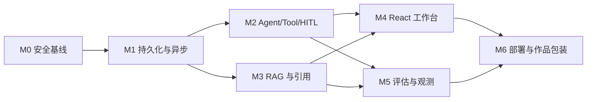

# Trailer 作品级开发路线图

本路线图对应 [作品级系统设计](PORTFOLIO_SYSTEM_DESIGN.md)。目标不是一次性推倒重写，而是在保留现有路线分析、Provider、LangGraph 和 62 项测试的基础上逐层升级。

## 1. 范围取舍

### 必须完成（作品集主线）

- 服务端任务、run、报告和事件持久化。
- 后台执行、SSE 重连、checkpoint 恢复。
- 结构化 AgentState、Tool Registry、Evidence/Safety Reviewer。
- 至少一种完整 RAG 文档链路：PDF/网页摄取、混合检索、重排、引用。
- Human-in-the-loop 审批。
- React 多页面：创建、执行、报告、历史、知识库、工具/Agent 配置。
- OpenTelemetry/结构化日志/token-cost 与评估回归集。
- Docker Compose、CI、演示数据和项目架构文档。

### 可以后置（避免作品变成无底洞）

- 真正付款、订票和酒店预订。
- 原生移动端和离线导航。
- 多人实时协作编辑。
- 复杂计费系统。
- Kubernetes、多区域高可用。
- 覆盖所有文件类型和所有地图/交通 Provider。

## 2. 推荐里程碑

按全职 4–5 周或业余 7–9 周估算。每个里程碑都必须能独立演示，避免最后一周才“看起来像产品”。

### M0：基线清理与安全底座（2–3 天）

**目标：** 把当前 MVP 冻结成可信基线，先消除会在演示中直接扣分的问题。

任务：

- 修复重复字段/重复 warning 等已知模型与流程瑕疵。
- 建立统一 `AppError` 和公共错误响应，前端不展示原始 Pydantic/堆栈。
- 对地方电话、开放状态、班次和票价增加 `verified/source/observed_at` 字段；无证据不展示为事实。
- 给所有 Provider 增加 timeout、错误分类和日志脱敏。
- 更新 `PROJECT_STATUS.md`，明确 current 与 target。
- 为现有 62 个测试建立 CI，增加安全回归样本。

验收：

- `pytest` 全通过。
- 执行页面无内部异常文本或密钥。
- 要求模型生成未核验地方电话时，报告只输出“待核验”。
- GitHub Actions/CI 可在干净环境运行。

### M1：任务持久化与异步运行（4–5 天）

**目标：** 从“一次 HTTP 请求”升级为“可管理任务”。

任务：

- 引入 PostgreSQL、SQLAlchemy 2、Alembic；先实现 users/tasks/task_inputs/files/runs/run_events/reports。
- 引入 Redis + Celery，将攻略生成移到 Worker。
- `POST /tasks/{id}/runs` 返回 202；`GET /runs/{id}/events` 提供可回放 SSE。
- 每个事件写 `seq`，支持 `Last-Event-ID`。
- LangGraph checkpoint 持久化；实现失败节点重试和取消。
- localStorage 历史迁移到服务端，localStorage 仅保存 UI 偏好。

验收：

- 关闭浏览器后任务继续执行，再打开可恢复时间线。
- 重启 API 后仍能读取任务和报告。
- Worker 在中间节点异常退出后可从 checkpoint 恢复，不重复成功工具调用。
- 同一 run 不生成重复报告。

### M2：Agent 与工具体系重构（5–6 天）

**目标：** 展示真正的 Agent 编排和安全执行能力。

任务：

- 将现有 `HikingPlannerState` 升级为版本化 `AgentState`。
- 拆出 Intake、Supervisor、Route、Environment、Logistics、Risk、Writer、Reviewer、Finalizer 节点。
- 路线/天气/交通/检索并行执行，使用显式 reducer 合并。
- Tool Registry 增加 schema、版本、权限、timeout、retry、cache、idempotency 和审计。
- 加入 Evidence Reviewer 与 Safety Reviewer；最多两轮修订。
- 实现 `ApprovalRequest`、`waiting_for_approval`、approve/reject/edit 和 resume。

验收：

- Run 详情可看到每个 Agent 与工具的结构化输入输出摘要。
- Provider 超时能自动重试并正确降级。
- 分享链接/发送邮件模拟工具一定会暂停等待审批。
- 未核验高风险 claim 无法通过 Finalizer。

### M3：Evidence-first RAG（5–6 天）

**目标：** 让报告的重要结论可追溯，而不是只写“数据来源：某某”。

任务：

- 引入 MinIO/S3、pgvector 和 PostgreSQL 全文检索。
- 完成 PDF/HTML 摄取、清洗、chunk、embedding、索引和文档状态。
- 实现 BM25/tsvector + vector + RRF + rerank。
- 加入文档 ACL、trust tier、published/observed/stale 时间。
- 建立 `EvidencePack -> ClaimList -> Citation` 链路。
- 报告中加入 `[E#]`，前端证据侧栏显示原文和时效。
- 加入 prompt injection 隔离：检索文本只作为数据，不获得工具/系统指令权限。

验收：

- 上传一份攻略 PDF 后可查看解析状态、chunks，并用检索测试页找到标注内容。
- 官方公告和社区攻略冲突时，报告同时呈现并优先官方来源。
- 删除/撤权文档后，后续检索不可访问其 chunks。
- 高风险 claim 引用覆盖率 100%。

### M4：React 产品工作台（6–8 天）

**目标：** 将当前有视觉特色的单页升级为可导航、可维护的真实产品。

任务：

- 建立 React + TypeScript + Vite 应用，迁移现有颜色、地图和图表资产。
- 实现首页、创建任务、执行过程、报告、历史任务。
- 实现知识库、Agent 配置、工具管理和设置页的 MVP。
- 执行页支持断线重连、节点重试、审批卡、开发者模式。
- 报告页支持证据侧栏、版本 diff、PDF 导出。
- 加入 loading/empty/error/partial/waiting approval 等完整状态。
- 增加响应式、键盘可用和不依赖颜色的状态提示。

验收：

- 主要流程没有直接操作 JSON 的页面。
- 手机和桌面都能完成“创建 → 观察执行 → 审批 → 查看报告”。
- 刷新任意详情页不会丢状态。
- 原生单文件前端退出主链路，只保留迁移期 fallback 或删除。

### M5：可观测性与评估（4–5 天）

**目标：** 能回答“系统怎么知道自己变好了”。

任务：

- 接入 OpenTelemetry，打通 API/Worker/LLM/Tool spans。
- 建立 run、节点、工具和模型指标面板。
- 记录 token、成本、p50/p95、缓存、重试和错误码。
- 建立首批 30 个 golden cases 和版本化评估数据集。
- 实现确定性 grader、引用 grader、风险 recall、rubric judge 和人工复核。
- PR 跑快速集，主分支跑完整集，输出基线差异。

验收：

- 能从一个失败报告跳到对应 span 和 tool call。
- 能比较两个 prompt/model/config 版本的质量、成本和延迟。
- 漏掉高风险规则或生成未支持 claim 时 CI 失败。
- 评估结果可在前端 `/evaluations` 查看。

### M6：交付、部署与作品包装（3–4 天）

**目标：** 让招聘者在 10 分钟内理解并运行项目。

任务：

- Docker Compose 一键启动 web/api/worker/postgres/redis/minio/observability。
- 提供 `.env.example`、seed demo、数据库迁移和健康检查。
- README 重写为“问题 → 架构 → 关键决策 → Demo → 评估 → 本地启动”。
- 制作 3–5 分钟演示视频和架构图。
- 准备一个固定的高风险 demo case、一个 Provider 故障 case、一个 HITL case。
- 增加 CI：lint/type/test/migration/eval/docker build。

验收：

- 新机器按 README 可在 15 分钟内启动演示。
- 无真实 API key 时仍可通过录制 fixtures/mock provider 完整演示。
- 演示过程能稳定展示恢复、引用、审批和评估，而不依赖临场网络运气。

## 3. 建议的实施顺序与依赖

M2 与 M3 可部分并行，但不要在 M1 前做：没有任务/run/checkpoint 数据模型，RAG 证据和 Agent 事件很快会被迫重写。

## 4. 每周可交付切片

如果只有四周：

| 周 | 可演示结果 |
| --- | --- |
| 第 1 周 | 数据库任务 + Worker + 可恢复 SSE；现有 UI 能使用新 API |
| 第 2 周 | 新 AgentState、Tool Registry、Reviewer、HITL；故障/审批演示可跑 |
| 第 3 周 | RAG 摄取、混合检索、报告引用；React 核心三页 |
| 第 4 周 | 完整工作台、评估、OTel、Docker、README 和视频 |

时间不足时，优先砍掉 Agent 配置编辑器的复杂功能、多人协作和多 Provider，不能砍持久化、证据、HITL、可观测或评估；后五者才是项目区别于 Demo 的核心。

## 5. 工程任务拆分建议

### Epic A：Platform

- A1 数据库与 Alembic
- A2 Repository/Unit of Work
- A3 Redis/Celery
- A4 对象存储
- A5 Auth/workspace/ACL
- A6 Docker Compose

### Epic B：Agent Runtime

- B1 AgentState v2 与 migration
- B2 Checkpointer 和 resume
- B3 Supervisor/worker nodes
- B4 Tool Registry middleware
- B5 HITL approval
- B6 Reviewer/finalizer

### Epic C：Evidence/RAG

- C1 document ingestion
- C2 chunk/index
- C3 hybrid retrieval/rerank
- C4 evidence/claim/citation
- C5 trust/staleness/ACL
- C6 retrieval evaluation

### Epic D：Product UI

- D1 React shell/design tokens
- D2 task creation
- D3 run timeline
- D4 approval center
- D5 report/evidence/diff
- D6 history/knowledge/tools/agents/evals

### Epic E：Quality

- E1 OpenTelemetry/log redaction
- E2 metrics/dashboard
- E3 golden datasets/graders
- E4 CI quality gates
- E5 seed fixtures/demo recording

## 6. Definition of Done

任何 Agent/Tool 功能只有同时满足以下条件才算完成：

- 有 Pydantic 输入/输出 schema 和版本。
- 有权限、超时、重试、缓存、幂等和错误策略。
- 有单元测试、失败/降级测试和至少一个 Agent 回放样本。
- 有 Trace/span、token/cost 或工具耗时记录。
- 有前端 success/loading/empty/error/partial 状态。
- 事实输出包含来源、时间、可信度和过期策略。
- 高风险动作经过 Policy/HITL。
- README 或 ADR 记录关键设计决策。

## 7. 面试演示脚本（5 分钟）

1. **30 秒：问题。** 展示真实 KML，说明用户已有路线，但天气、补给、交通和风险信息分散且时效不同。
2. **45 秒：创建任务。** 上传路线，预检立即发现一段缺海拔并给出数据质量，而不是先调用模型。
3. **60 秒：Agent 执行。** 展示 Route/Weather/RAG 并行、Tool Registry、一次 Provider 超时与降级；刷新页面后进度仍在。
4. **45 秒：HITL。** 系统发现地方救援电话无可信证据，暂停并要求删除或补充来源；批准“删除未核验内容后继续”。
5. **60 秒：报告。** 点击天气/开放/补给结论的引用，展示来源片段、抓取时间和可信等级；对比报告 v1/v2 的天气变化。
6. **45 秒：工程质量。** 打开 Trace 和评估页，展示节点耗时、token/cost、引用正确率与关键风险 recall。
7. **15 秒：总结。** 强调 LLM 负责计划和表达，代码、证据和审批保证系统边界。

## 8. 简历与项目介绍表述

建议避免“使用 LangChain 调用大模型生成攻略”这种容易被归类为 Demo 的描述。可以写成：

- 设计并实现面向徒步行前决策的异步 Agent 工作台，以 LangGraph 编排路线、天气、交通、RAG、风险分析和双重审核节点，支持 checkpoint 恢复与 Human-in-the-loop。
- 构建版本化 Tool Registry，将 schema 校验、权限、超时重试、缓存、幂等和审计统一到工具执行层，并为外部 Provider 设计可解释降级。
- 基于 PostgreSQL/pgvector 实现 BM25 + 向量检索 + RRF + rerank 的 Evidence-first RAG，使关键安全结论关联可追溯证据和时效信息。
- 打通 React 执行时间线与 OpenTelemetry Trace，展示 Agent/工具耗时、token、成本、错误和重试；建立 golden set 与安全门禁评估。

最终数字应替换为实测结果，例如任务完成率、Critical Risk Recall、引用正确率、p95 延迟、缓存命中率和测试数量；不要提前编造优化百分比。
