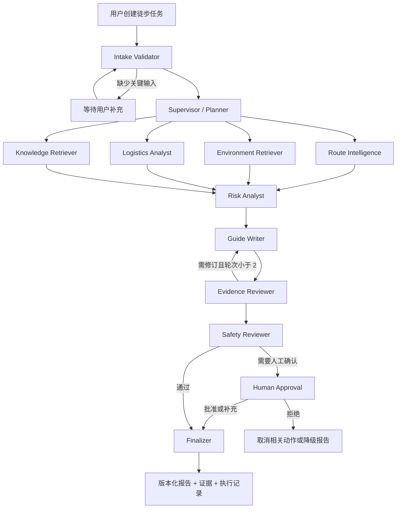
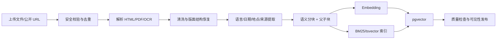
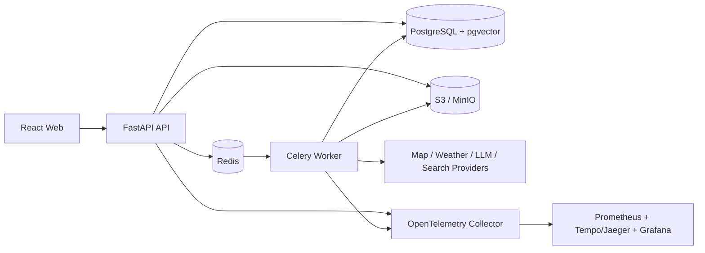

# Trailer 作品级系统设计

> 定位：不是“会聊天的徒步机器人”，而是一个可追踪、可恢复、可核验的 AI 徒步决策与安全工作台。
>
> 文档状态：目标架构（Target Architecture）  
> 当前基线：FastAPI + LangGraph + 原生前端 + SSE，62 项测试通过

## 0. 设计结论

项目建议继续深耕现有徒步业务，而不是改成泛化 Agent 平台。最终产品名称可保持 **Trailer**，副标题调整为：

> **Trailer — AI 徒步决策与安全工作台**  
> 将一条 KML/GPX 轨迹转化为有证据、可执行、可复核的行前方案。

作品最应该传达的五个能力是：

1. **任务型 Agent，而非聊天壳**：围绕一次真实行程创建任务、异步执行、暂停审批、恢复、版本化并产出报告。
2. **LLM 与确定性代码分工**：模型负责理解、计划、归纳与表达；距离、爬升、风险规则、权限和状态迁移由代码控制。
3. **Evidence-first RAG**：所有重要结论都能追溯到轨迹、天气、官方公告或用户资料，并展示来源、时间和可信度。
4. **安全与人在回路**：未核验的救援电话、开放状态、交通时刻不能被包装成事实；高风险操作必须等待审批。
5. **可运维的软件系统**：有数据库、后台任务、检查点、Trace、成本、评估、故障降级和完整前端，而不只是一次请求一次回答。

### 0.1 当前基线与目标差距

| 维度 | 当前已有 | 作品级目标 |
| --- | --- | --- |
| 业务 | KML 行前攻略、天气、POI、交通、安全建议 | 可持续更新的“行程任务 + 安全决策报告” |
| Agent | 单个 LangGraph 顺序工作流 | Supervisor + 专业节点 + Reviewer + Finalizer，可并行、暂停和恢复 |
| 状态 | 进程内 `TypedDict` | 持久化、版本化、可重放的 `AgentState` 与 checkpoint |
| 工具 | Python 方法级 Registry | 带 schema、权限、超时、重试、缓存、审计和版本的 Tool Registry |
| 知识 | 读取链接/笔记后启发式抽取 | 文档摄取、混合检索、重排、证据包、逐条引用 |
| 记忆 | 当前请求上下文 + 浏览器 localStorage | 短期状态、长期偏好、不可变执行记忆 |
| 安全 | 告警与免责声明 | 风险分级、敏感工具审批、关键事实证据闸门、审计日志 |
| 可观测 | SSE 文案轨迹 | run/span/tool call、token/cost、延迟、错误、重试、输入输出摘要 |
| 评估 | 62 个单元/接口测试 | 确定性测试 + 检索评估 + Agent 回归集 + 安全门禁 |
| 前端 | 单页大文件、localStorage 历史 | React 多页面工作台、执行时间线、证据侧栏、审批中心 |
| 后端 | 同步 API，无数据库 | PostgreSQL/pgvector + Redis + Worker + 对象存储 + SSE |

### 0.2 当前必须优先修复的产品风险

- 执行页面会暴露原始 Pydantic 错误；面向用户应显示可理解的错误码和恢复建议，详细堆栈只进入受控日志。
- 安全报告可能产生具体但未核验的电话号码。除全国通用号码外，地方救援信息必须来自带时间戳的可信来源；否则只能显示“待核验”。
- `AgentTraceEvent` 目前是展示文案，不足以支持重试、恢复、成本归因和审计。
- 前端历史仅存在 `localStorage`，无法跨设备、协作或恢复服务端任务。
- `PROJECT_STATUS.md` 与当前 README/实现存在时效差异，后续以自动生成的能力清单和版本化 Roadmap 避免文档漂移。

---

## 1. 业务场景设计

### 1.1 目标用户

**核心用户：** 计划 1–3 天非商业徒步的城市户外爱好者或小队组织者。他们通常能从两步路、奥维、朋友或社群获得一条轨迹，但不擅长把路线、天气、交通、补给和安全信息整合成可靠计划。

**次级用户：** 户外社群领队、小型俱乐部运营者，需要重复制作行前说明、装备清单和风险告知，并保留信息来源与修改记录。

第一版不面向专业探险、无人区救援或实时导航；这些场景的责任边界和数据要求远高于作品项目可承担范围。

### 1.2 核心痛点

1. 信息分散在轨迹 App、天气、地图、票务、景区公告和社区攻略中，整理成本高。
2. 社区攻略主观、过时且缺少来源时间，用户难以判断哪些仍然有效。
3. 路线里程、爬升和体能不匹配时，普通用户很难量化风险。
4. 天气和开放状态持续变化，一次生成的攻略很快过期。
5. 通用 AI 会给出流畅但无依据的救援电话、交通时刻或安全结论。
6. 传统攻略只有最终文本，无法看到系统查了什么、失败在哪里、哪些内容需要自己确认。

### 1.3 输入与输出

**输入：**

- 必需：目的地或路线名称、出行日期、至少一种路线输入（KML/GPX/路线描述）。
- 推荐：出发城市、人数、队伍体能、是否有新手/儿童、交通偏好、装备条件。
- 可选：公开攻略链接、PDF/截图、个人笔记、俱乐部 SOP、历史行程。

**输出不是一段聊天文字，而是一个版本化的 `Trip Safety Brief`：**

- 路线量化：距离、爬升、耗时、关键区段、数据质量。
- 天气窗口：逐日天气、风险解释、数据更新时间和失效时间。
- 行程方案：每日路线、时间预算、补给、住宿、交通与备选方案。
- 风险登记册：风险、证据、严重度、概率、缓解措施、待核验项。
- 装备清单：由路线、天气、队伍条件驱动，可勾选。
- 证据与引用：每条关键事实对应来源、抓取时间、原文片段。
- 行前检查：明确“已确认 / 待确认 / 已过期”。
- 可导出的 PDF/分享页，以及本次 Agent 完整执行记录。

### 1.4 典型使用流程

1. 用户创建“6 月 28 日虎跳峡徒步”任务并上传 KML。
2. 系统先做确定性预检：文件是否合法、坐标系、海拔完整度、日期和队伍信息是否齐全。
3. Supervisor 生成任务计划；路线、环境、交通和知识检索节点并行执行。
4. 风险分析节点将轨迹、天气和资料转为结构化风险，而不是直接让 LLM 自由发挥。
5. Writer 生成草稿；Evidence Reviewer 检查每个关键结论是否有证据，Safety Reviewer 检查高风险表述。
6. 若路线来源不可靠、地方救援电话未核验或出发日期超出天气预测窗口，流程暂停并请求用户确认。
7. 用户在执行页查看工具结果、失败与待确认项，批准后 Finalizer 生成报告 v1。
8. 出发前 24 小时用户点击“刷新行前状态”，系统只重跑易变节点，生成报告 v2 和变化摘要。
9. 行程结束后用户反馈实际耗时、天气和 POI 状态，作为后续评估数据；未经同意不自动写入公共知识库。

### 1.5 产品边界

- 不替代专业导航、官方公告、景区管理或救援服务。
- 不声称自动生成的候选路线是“热门路线”或“安全路线”。
- 不自动预订、付款、发送邮件、发布内容或修改原始轨迹。
- 不展示无来源的地方救援电话、开放状态、班次和票价。
- 不向用户暴露模型隐藏推理；只展示结构化计划、工具动作、证据和简短决策摘要。

---

## 2. Agent 架构设计

### 2.1 设计原则

- **角色不是越多越好。** 只有当节点拥有独立输入输出、工具权限、失败策略或评估标准时，才拆成 Agent。
- **Supervisor 只编排，不制造事实。** 专业数据来自工具和 Evidence Pack。
- **高风险判断双轨制。** 代码规则给出底线，模型只能补充解释，不能覆盖硬规则。
- **并行执行独立任务。** 路线、天气、交通和 RAG 可并行，降低总耗时。
- **Reviewer 有退出条件。** 最多两轮修订，仍不合格则降级为“部分完成 + 待核验”，避免无限循环。

### 2.2 Agent 角色

| 角色/节点 | 职责 | 核心输入 | 结构化输出 | 可用工具 | 失败策略 |
| --- | --- | --- | --- | --- | --- |
| Intake Validator | 校验请求、文件和缺失信息 | 用户输入、上传文件 | `TaskContext`、阻塞问题 | 文件检测、schema 校验 | 可修复则规范化；不可修复则等待用户 |
| Supervisor / Planner | 拆解任务、选择能力、设置依赖与预算 | `TaskContext`、Agent 配置 | `ExecutionPlan` | 只读 Agent/Tool 目录 | Planner 失败时使用静态保守计划 |
| Route Intelligence | 解析和量化路线、识别数据质量 | KML/GPX、路线文本 | `RouteEvidence` | 路线解析、坐标转换、海拔、统计 | 无可靠路线则暂停，不自动声称安全 |
| Environment Retriever | 获取天气、预警、开放信息 | 路线采样点、日期 | `EnvironmentEvidence` | 天气、公告检索、缓存 | 标注缺口和有效期，允许部分完成 |
| Logistics Analyst | 生成交通、住宿、补给候选 | 起终点、日期、偏好 | `LogisticsEvidence` | 地理编码、POI、交通 | 不确定时输出候选和核验动作 |
| Knowledge Retriever | 从用户/公共知识库找资料 | 查询计划、ACL、时空过滤 | `EvidencePack` | Hybrid Search、Reranker | 检索为空时明确无证据，不脑补 |
| Risk Analyst | 合并硬规则与证据，形成风险登记册 | 路线、天气、队伍、证据 | `RiskRegister` | 风险规则引擎、评分器 | 关键数据缺失时提高不确定性并触发审批 |
| Guide Writer | 将结构化结果写成可执行草稿 | 前述全部结构化产物 | `ReportDraft` + `ClaimList` | 无外部写工具 | 只允许引用 Evidence Pack 中的事实 |
| Evidence Reviewer | 检查事实、引用、时效和冲突 | 草稿、ClaimList、证据 | `ReviewResult` | 引用校验、NLI/规则检查 | 退回 Writer，最多两轮 |
| Safety Reviewer | 检查危险建议、未核验联系方式和越权动作 | 草稿、风险登记册、策略 | `SafetyReview` | Policy Engine | 高风险失败则阻塞 Finalizer |
| Finalizer | 组装最终报告、版本和变化摘要 | 通过审核的草稿 | `FinalReport` | 渲染、PDF 导出 | 导出失败不影响 JSON/HTML 报告 |

### 2.3 任务流转



### 2.4 LangGraph 实现建议

- 使用 `PostgresSaver`（或自建 PostgreSQL checkpointer）按 `thread_id=task_id`、`checkpoint_ns=run_id` 持久化状态。
- `route/environment/logistics/retrieval` 使用并行 fan-out，结果通过显式 reducer 合并，禁止节点原地修改共享对象。
- `interrupt_before=["human_approval"]` 暂停流程，审批后使用 command/resume 恢复。
- 每次运行固定 `agent_config_version`、`prompt_version`、`tool_version` 和 `model_config`，保证可重放。
- 节点输出先通过 Pydantic 校验再写入 state；校验失败变成结构化 `RunError`，不把原始异常直接传给前端。

---

## 3. 状态流转设计

### 3.1 AgentState

```python
class AgentState(TypedDict):
    # 身份与版本
    task_id: str
    run_id: str
    user_id: str
    workspace_id: str
    state_version: int
    agent_config_version: str
    prompt_version: str

    # 用户输入与规范化上下文
    user_request: UserRequest
    task_context: TaskContext
    input_files: list[FileRef]
    constraints: ExecutionConstraints

    # 计划与控制
    execution_plan: ExecutionPlan
    current_phase: str
    node_attempts: dict[str, int]
    review_round: int
    pending_approval: ApprovalRequest | None

    # 中间业务结果
    route_evidence: RouteEvidence | None
    environment_evidence: EnvironmentEvidence | None
    logistics_evidence: LogisticsEvidence | None
    retrieved_evidence: EvidencePack | None
    risk_register: RiskRegister | None
    report_draft: ReportDraft | None
    review_results: list[ReviewResult]

    # 执行记录（append-only reducer）
    tool_results: list[ToolResult]
    events: list[RunEvent]
    errors: list[RunError]
    warnings: list[RunWarning]
    usage: UsageSummary

    # 最终结果
    final_report: FinalReport | None
    status: RunStatus
```

### 3.2 关键子模型

`RunStatus`：

```text
queued -> running -> waiting_for_input | waiting_for_approval
       -> running -> succeeded | partially_succeeded | failed | cancelled
```

`ToolResult` 统一封装：

```json
{
  "tool_call_id": "tc_123",
  "tool_name": "weather.forecast",
  "tool_version": "1.2.0",
  "status": "success",
  "data": {},
  "evidence_refs": ["ev_12"],
  "source": "open-meteo",
  "observed_at": "2026-06-20T10:00:00+08:00",
  "stale_at": "2026-06-20T16:00:00+08:00",
  "confidence": 0.92,
  "warnings": [],
  "error": null,
  "latency_ms": 842,
  "cache_hit": false
}
```

`RunError`：`code`、`category`、`message_user`、`message_internal`、`retryable`、`node`、`tool_call_id`、`attempt`、`occurred_at`。前端只接收 `message_user`；日志中的敏感字段需脱敏。

### 3.3 状态推进规则

1. 节点只读取所需字段，只返回更新字段。
2. `events/tool_results/errors/warnings/review_results` 使用 append-only reducer。
3. 每个节点开始和结束都写 checkpoint；昂贵工具调用完成后立即写 checkpoint。
4. 相同 `idempotency_key` 的工具调用不重复执行；重试复用已成功结果。
5. 失败分为：可重试、可降级、需用户输入、需审批、不可恢复。
6. 最终报告只从“已通过审核的状态快照”生成，不能直接读取未审核自由文本。
7. 状态 schema 每次变更增加 `state_version`，提供 migration，保证旧任务能恢复。

### 3.4 前端可展示事件

事件流只传递可公开的结构化事件：`run.started`、`node.started`、`tool.started`、`tool.completed`、`tool.failed`、`node.completed`、`approval.requested`、`review.failed`、`report.completed`。

每个事件包含 `event_id/run_id/node/span_id/status/progress/title/summary/occurred_at`。前端不展示隐藏思维链，只展示“为什么需要此工具”的短摘要、输入摘要、输出摘要与证据。

---

## 4. 工具调用与 Tool Registry

### 4.1 LLM 与代码的职责边界

| 交给 LLM | 交给确定性代码 |
| --- | --- |
| 理解自然语言偏好、生成查询计划 | 文件类型/大小/恶意内容校验 |
| 将复杂目标拆成任务 | KML/GPX 解析、坐标转换、距离/爬升计算 |
| 对多条证据做有约束的归纳 | 时间、金额、单位、天气阈值和风险规则 |
| 生成报告草稿和变化摘要 | 权限、审批、状态迁移、重试、缓存、去重 |
| 识别资料中的候选风险线索 | 引用存在性、有效期、来源 ACL 校验 |
| 在固定 schema 中解释结论 | PDF 渲染、存储、哈希、审计记录 |

原则：**任何可用公式、规则或 API 明确完成的事情，都不让模型“猜”。**

### 4.2 ToolDefinition

```python
class ToolDefinition(BaseModel):
    name: str                     # route.parse
    version: str                  # semver
    description: str
    input_model: type[BaseModel]
    output_model: type[BaseModel]
    permission: Literal["read", "write", "external_action", "destructive"]
    approval_policy: Literal["never", "conditional", "always"]
    timeout_seconds: int
    max_retries: int
    cache_ttl_seconds: int | None
    idempotent: bool
    redact_fields: list[str]
    owner: str
```

Registry 负责：schema 校验、权限检查、审批检查、超时、指数退避、熔断、缓存、调用日志、错误映射和版本固定。Agent 不直接调用 Provider。

### 4.3 首版工具清单

| 工具 | 类型 | 输入 | 输出 | 权限/审批 | 主要错误处理 |
| --- | --- | --- | --- | --- | --- |
| `file.inspect` | 代码 | 文件引用 | MIME、大小、hash、安全结果 | read / 自动 | 拒绝超限、伪装格式、压缩炸弹 |
| `route.parse` | 代码 | KML/GPX | 标准轨迹、多段信息、质量 | read / 自动 | 非法坐标、点数不足给明确错误 |
| `route.normalize_coordinates` | 代码 | 轨迹、源/目标坐标系 | 标准 WGS84/GCJ02 | read / 自动 | 未知坐标系不静默转换 |
| `route.compute_stats` | 代码 | 标准轨迹 | 距离、爬升、坡度、耗时 | read / 自动 | 缺海拔时降级并附置信度 |
| `route.enrich_elevation` | API | 轨迹采样点 | 海拔序列与来源 | read / 自动 | 超时重试、批量限流、缓存 |
| `geo.geocode` | API | 地名 | 候选坐标 | read / 自动 | 多义结果进入用户确认 |
| `weather.forecast` | API | 坐标、日期范围 | 天气、预警、有效期 | read / 自动 | 多源补齐；过期数据不可用于最终结论 |
| `places.search_along_route` | API+代码 | 轨迹、POI 类型 | 排序后的 POI | read / 自动 | 空结果和 Provider 失败分开表示 |
| `transport.search` | API | 城市、目的地、日期 | 交通候选 | read / 自动 | 价格/时刻默认要求核验 |
| `document.extract` | 代码 | PDF/HTML/图片 | 文本、版面、metadata | read / 自动 | OCR 低置信度标记，不强行入库 |
| `knowledge.hybrid_search` | 检索 | query、filters、ACL | 候选 chunks | read / 自动 | 无结果返回空 Evidence Pack |
| `knowledge.rerank` | 模型/代码 | query、chunks | 排序与相关度 | read / 自动 | 失败回退 RRF 排序 |
| `risk.score` | 规则代码 | 路线、天气、队伍 | 风险分、触发规则 | read / 自动 | 规则版本写入结果 |
| `report.render_pdf` | 代码 | 报告版本 | PDF FileRef | write / 条件 | 幂等渲染，不覆盖旧版本 |
| `report.publish_share_link` | 代码 | 报告、有效期 | 分享链接 | external_action / 必须 | 审批、撤销、审计 |
| `notification.send_email` | 外部动作 | 收件人、模板、报告 | 发送回执 | external_action / 必须 | 预览、确认收件人、防重复发送 |
| `file.delete` | 代码 | FileRef | 删除回执 | destructive / 必须 | 软删除、二次确认、审计 |

### 4.4 标准错误码

- `TOOL_INPUT_INVALID`：输入 schema 不合法，不重试。
- `PROVIDER_AUTH_FAILED`：配置问题，熔断并通知管理员。
- `PROVIDER_RATE_LIMITED`：按 `Retry-After` 重试。
- `PROVIDER_TIMEOUT`：指数退避，达到上限后降级。
- `DATA_NOT_FOUND`：成功调用但无数据，不视为系统异常。
- `DATA_STALE`：数据存在但已过期，不能用于关键结论。
- `APPROVAL_REQUIRED`：保存调用参数并暂停。
- `POLICY_DENIED`：策略禁止，不允许模型绕过。

---

## 5. RAG / 知识库设计

### 5.1 需要进入知识库的内容

- 景区/保护区官方公告、开放时间、防火/封闭通知。
- 用户上传的攻略 PDF、网页、截图、俱乐部 SOP 和行前模板。
- 可靠的装备规范、天气风险说明、基础急救资料。
- 历史任务报告和用户复盘（仅限本人/工作区 ACL）。

实时天气、POI、票价、路线统计不进入普通 RAG 作为事实源，它们通过工具实时获取；RAG 只可保存带 `observed_at/stale_at` 的快照用于审计。

### 5.2 摄取流程



摄取要求：

- 原始文件存对象存储，数据库保存 SHA-256；相同内容不重复处理。
- HTML 去除脚本、广告和导航，保留标题层级与来源 URL。
- PDF 优先版面解析，扫描件进入 OCR；低置信度文本需要人工确认。
- chunk 推荐 400–800 tokens、10%–15% overlap，按标题/段落边界切分；保留 parent chunk。
- 每个 chunk 保存：`document_id/page/section/source_url/source_type/published_at/observed_at/stale_at/region/route_tags/acl/language/content_hash`。
- 官方来源、用户资料、社区经验采用不同 `trust_tier`，检索和报告中不得混为一谈。

### 5.3 检索流程

1. Supervisor 生成 2–4 个检索子问题，不生成答案。
2. 从任务提取地区、日期、路线名、文档类型和 ACL 过滤条件。
3. PostgreSQL 全文检索与 pgvector 各取 Top 30。
4. 用 Reciprocal Rank Fusion 合并并去重。
5. Cross-encoder/LLM reranker 取 Top 8–12；失败时使用 RRF 结果。
6. 对时效性资料执行 `published_at/stale_at` 过滤，对冲突资料成组返回。
7. 组装 `EvidencePack`，每条证据分配稳定 `evidence_id`。
8. Writer 生成 `ClaimList`，每条可核验 claim 必须引用一个或多个 `evidence_id`。
9. Evidence Reviewer 检查引用是否真实支持 claim、是否过期、是否跨 ACL。

### 5.4 引用与防幻觉

最终报告中的关键结论显示类似 `[E12]` 的引用，点击后打开证据侧栏：来源、标题、原文片段、抓取时间、有效期和可信等级。

以下内容必须有证据，否则改为“待核验”：

- 地方救援/景区联系电话。
- 路线开放、封闭、防火、预约和备案要求。
- 交通班次、末班、价格和可预订状态。
- 水源、补给点、住宿营业状态。
- 具体天气预警和逐日预测。

引用质量门禁：`citation_coverage >= 0.85`、`citation_correctness >= 0.90`，且所有高风险 claim 覆盖率必须为 1.0。

---

## 6. 记忆系统设计

### 6.1 三层记忆

| 类型 | 内容 | 存储 | 生命周期 | 写入规则 |
| --- | --- | --- | --- | --- |
| 短期记忆 | 当前请求、状态、中间结果、审批上下文 | LangGraph checkpoint + PostgreSQL | 单次任务/运行 | 节点自动写入，随状态版本管理 |
| 长期记忆 | 用户体能、常用出发地、交通偏好、装备偏好 | 结构化 `user_memories`，必要时向量索引 | 跨任务 | 只有明确同意或用户主动设置才写入 |
| 执行记忆 | 节点、工具调用、输入输出摘要、错误、token、成本、版本 | `runs/run_steps/tool_calls/run_events/audit_logs` | 按审计策略保留 | append-only，不允许 Agent 改写历史 |

### 6.2 长期记忆原则

- 优先结构化字段，不把整段聊天直接塞进向量库。
- 保存 `source/consent_scope/confidence/created_at/last_confirmed_at/expires_at`。
- 偏好与事实分开：`偏好公共交通` 可长期保存，`膝盖受伤` 属敏感健康信息，默认不保存。
- 用户可查看、编辑、删除和禁用长期记忆。
- 生成任务时展示“本次使用了哪些记忆”，避免隐形个性化。

---

## 7. 人工审批与安全边界

### 7.1 风险等级

| 等级 | 示例 | 策略 |
| --- | --- | --- |
| L0 只读低风险 | 解析文件、路线统计、检索资料、生成草稿 | 自动执行并记录 |
| L1 有影响但可逆 | 生成新报告版本、保存偏好、刷新外部数据 | 条件确认或提供撤销 |
| L2 外部动作 | 发布分享链接、发送邮件、写入日历、提交反馈 | 每次明确审批，展示完整预览 |
| L3 高风险/破坏性 | 删除文件、覆盖路线、付款/预订、自动提交代码 | 强制审批；部分能力首版直接禁止 |

### 7.2 安全事实闸门

即使没有外部写操作，以下情况也必须暂停或显著阻塞最终结论：

- 路线无法可靠解析或坐标存在明显异常。
- 高风险天气数据缺失、过期或多源冲突。
- 报告包含未核验的地方救援电话或开放状态。
- 用户体能/队伍信息与路线风险明显不匹配。
- 模型建议偏离确定性风险规则。

### 7.3 Human-in-the-loop 流程

1. 节点产生 `ApprovalRequest(action, reason, risk_level, payload_preview, expires_at)`。
2. run 状态变为 `waiting_for_approval`，checkpoint 落库并发送 SSE 事件。
3. 前端审批卡展示：将发生什么、影响范围、依据、可选修改和拒绝后果。
4. 用户可 `approve/reject/edit`；任何审批都记录用户、时间、原 payload 和修改后 payload。
5. Worker 使用审批 token 恢复对应 checkpoint；过期审批不得执行。
6. 外部动作使用 idempotency key，避免恢复或重试时重复发送。

---

## 8. 可观测性设计

### 8.1 Trace 层级

```text
task
└── run (trace_id)
    ├── supervisor.plan (span)
    ├── route_intelligence (span)
    │   ├── route.parse (tool span)
    │   └── route.compute_stats (tool span)
    ├── environment_retriever (span)
    │   └── weather.forecast (tool span)
    ├── knowledge_retriever (span)
    ├── risk_analyst (span)
    ├── writer (LLM span)
    ├── evidence_reviewer (LLM/rule span)
    └── finalizer (span)
```

每个 span 记录：`trace_id/span_id/parent_span_id/run_id/node/tool/model/start/end/duration/status/attempt/cache_hit/input_summary/output_summary/token_input/token_output/cost/error_code`。

### 8.2 日志、指标与追踪

- **Trace：** OpenTelemetry SDK；开发环境可用 Jaeger，线上可接 Grafana Tempo 或 Langfuse。
- **日志：** JSON structured logs，关联 `trace_id/run_id/user_id_hash`；禁止记录 API key、完整文件正文和敏感个人信息。
- **指标：** Prometheus/OpenTelemetry Metrics。
- **模型观测：** 模型名、prompt version、结构化解析成功率、token、成本、首 token 延迟。
- **工具观测：** Provider 成功率、p50/p95、超时率、重试率、缓存命中率、熔断状态。
- **业务指标：** 任务完成率、部分完成率、审批率、报告导出率、24h 刷新率、用户修改率。

### 8.3 前端执行过程页

执行页分三栏：

1. 左侧任务阶段：预检、收集、分析、写作、审核、完成。
2. 中间事件时间线：Agent/工具、耗时、状态、重试和结果摘要。
3. 右侧证据与调试：来源、输入输出摘要、token/cost、错误和恢复按钮。

普通用户默认看到产品化摘要；“开发者模式”才展示 span、模型、tool payload（脱敏）和成本。不要展示隐藏推理过程。

---

## 9. 评估体系设计

### 9.1 指标体系

| 层级 | 指标 | 计算方式 | 首版门槛 |
| --- | --- | --- | --- |
| 确定性能力 | 距离/爬升/日期/单位正确性 | 与标注或基准实现比较 | 关键字段在容差内 100% |
| 工具 | 成功率、超时率、降级正确率 | Tool call 日志 | 非 Provider 故障成功率 >= 95% |
| 检索 | Recall@10、MRR、nDCG@10 | 标注相关 chunk | Recall@10 >= 0.85 |
| 引用 | coverage、correctness、时效性 | claim-evidence 标注 + judge | coverage >= 0.85；correctness >= 0.90 |
| 风险 | Critical Risk Recall | 高风险样本召回 | >= 0.95，漏掉硬规则风险直接失败 |
| 报告 | 相关性、完整性、可执行性、格式 | rubric + 人工/LLM judge | 平均 >= 4/5 |
| 幻觉 | Unsupported Claim Rate | 无证据事实 claim / 全部事实 claim | <= 5%，高风险 claim 为 0 |
| 系统 | 完成率、恢复率、p95 延迟、成本 | 线上/回放 | 首事件 < 1s；完整任务 p95 < 90s |
| 用户 | 任务完成、修改率、满意度 | 埋点/反馈 | 报告有帮助 >= 80% |

评分不能掩盖安全失败：即使总分很高，只要出现未核验地方救援电话、错误开放状态或漏掉明确高风险天气，样本直接判定失败。

### 9.2 测试集构造

首版建立 30 个 golden cases，稳定后扩展到 80 个：

- 正常 KML/GPX 与多段路线。
- 坐标异常、缺海拔、损坏 XML、超大文件、恶意 HTML。
- 无日期、日期超出天气窗口、跨天气源冲突。
- 高海拔、长距离、大爬升、暴雨/大风/高温等安全场景。
- POI/交通为空、Provider 超时、限流、鉴权失败。
- 官方公告与社区攻略冲突、过期资料、无相关检索结果。
- Prompt injection、要求绕过审批、要求编造电话等对抗样本。
- 中文地名多义、路线名称相似、同名景区。

每个 case 包含输入、mock 工具结果、期望节点、必须包含/禁止包含、关键风险、证据引用和最大成本预算。

### 9.3 评估执行

- PR：运行现有单元测试 + 10 个快速 Agent 回放样本。
- 主分支：运行完整 golden set，生成与基线版本的差异报告。
- Prompt/model/tool 版本变更：强制执行回归评估。
- 线上抽样：只保存脱敏 Trace；用户明确授权后才进入评估集。
- Judge 结果必须定期与人工标注校准，不能只依赖另一个 LLM 给分。

---

## 10. 前端产品化设计

### 10.1 技术方案

将当前单文件原生前端迁移为：

- React + TypeScript + Vite
- React Router
- TanStack Query（服务端状态）
- Zustand（仅保存轻量 UI 状态）
- Tailwind/shadcn 或现有视觉 token 组件化
- 高德地图 SDK + ECharts/Chart.js
- SSE（支持 `Last-Event-ID` 重连）

选择 Vite 而不是为展示强行引入 SSR；产品核心是任务工作台和地图交互，FastAPI 继续作为独立后端。

### 10.2 信息架构

| 页面 | 核心内容 | 作品展示点 |
| --- | --- | --- |
| `/` 首页/工作台 | 产品价值、最近任务、风险提醒、快捷创建 | 真正 SaaS 首页，而非上传表单 |
| `/tasks/new` 创建任务 | 分步表单、文件上传、预检、队伍和偏好 | 数据校验与良好 onboarding |
| `/tasks/:id/run/:runId` 执行过程 | 阶段、事件时间线、工具、证据、审批、重试 | Agent 可观测性核心页面 |
| `/tasks/:id/report/:version` 报告 | 地图、路线、天气、行程、风险、装备、引用 | 核心业务价值与 evidence UX |
| `/tasks` 历史任务 | 搜索、筛选、状态、版本、刷新 | 服务端持久化和任务管理 |
| `/knowledge` 知识库 | 数据源、文档状态、chunk 预览、检索测试 | 完整 RAG 工程链路 |
| `/agents` Agent 配置 | 节点、模型、prompt 版本、预算、发布 | 配置版本化，不直接在线改生产 |
| `/tools` 工具管理 | schema、权限、Provider 健康、调用统计 | Tool Registry 与安全边界 |
| `/evaluations` 评估中心 | 数据集、回归结果、失败样本、版本对比 | AI 质量工程能力 |
| `/settings` 设置 | 用户、工作区、记忆、API 配置、隐私 | 产品完整性 |

### 10.3 核心交互

- 创建任务采用 4 步：路线 → 时间与队伍 → 偏好与资料 → 预检确认。
- 执行过程支持离开页面后继续运行，回来后从服务端恢复。
- 失败节点提供“重试此节点”“更换数据源”“补充输入”而不是只能全部重来。
- 报告中的事实点击 `[E12]` 打开证据侧栏；过期来源显示醒目标记。
- 报告版本对比突出天气、风险、交通和待核验项的变化。
- 审批使用 diff/preview，拒绝时允许选择“跳过并生成部分报告”。
- 工具和 Agent 配置修改先生成 draft version，通过测试后发布。

---

## 11. 后端、数据库与接口设计

### 11.1 推荐技术栈

- API：FastAPI、Pydantic v2、SQLAlchemy 2、Alembic
- Agent：LangGraph + PostgreSQL checkpoint
- 数据库：PostgreSQL + pgvector
- 缓存/队列：Redis + Celery Worker
- 文件：S3/MinIO
- 观测：OpenTelemetry + Prometheus + Jaeger/Tempo，可选 Langfuse
- 认证：JWT access/refresh，密码哈希；作品版可增加 GitHub OAuth
- 部署：Docker Compose 本地一键启动；云端拆分 web/api/worker

### 11.2 模块边界

```text
app/
├── api/                 # HTTP/SSE、鉴权、DTO
├── domain/              # task/report/evidence/risk 核心模型
├── agents/              # graph、nodes、reducers、policies
├── tools/               # registry、definitions、executors
├── providers/           # 高德、天气、模型、对象存储实现
├── rag/                 # ingestion、chunking、retrieval、rerank
├── services/            # application use cases
├── repositories/        # 数据访问
├── workers/             # 后台任务
├── observability/       # trace/log/metrics/redaction
└── evals/               # dataset、runner、graders
```

Provider 只适配第三方；业务规则放 `domain/services`；Agent 节点调用 Tool Registry，不直接依赖 Provider。

### 11.3 数据库表

| 表 | 关键字段 | 用途 |
| --- | --- | --- |
| `users` | id, email, password_hash, status, created_at | 用户管理 |
| `workspaces` / `memberships` | workspace_id, user_id, role | 多用户与权限 |
| `tasks` | id, workspace_id, title, destination, status, current_report_version | 徒步任务主记录 |
| `task_inputs` | task_id, input_json, schema_version | 用户输入快照 |
| `files` | id, storage_key, sha256, mime, size, status, owner_id | 上传与导出文件 |
| `task_files` | task_id, file_id, purpose | 任务文件关联 |
| `agent_configs` | id, name, status, current_version_id | Agent 配置 |
| `agent_config_versions` | id, config_id, graph_json, model_json, prompt_versions, created_by | 可重放配置版本 |
| `tool_definitions` | id, name, permission, approval_policy, schema_json | 工具目录 |
| `tool_versions` | tool_id, version, config_json, enabled | 工具版本与开关 |
| `runs` | id, task_id, status, trace_id, config_version_id, started_at, ended_at, cost | 一次 Agent 执行 |
| `run_steps` | id, run_id, node, attempt, status, input_summary, output_summary, timing | 节点记录 |
| `tool_calls` | id, run_id, step_id, tool_version, status, request_redacted, result_ref, latency, cost | 工具审计 |
| `run_events` | id, run_id, seq, event_type, public_payload, created_at | SSE 回放与重连 |
| `checkpoints` | run_id, checkpoint_id, state_blob, schema_version | 暂停/恢复 |
| `approvals` | id, run_id, action, risk_level, payload, status, decided_by, decided_at | 人工审批 |
| `reports` | id, task_id, run_id, version, status, content_json, content_hash | 版本化报告 |
| `report_claims` | id, report_id, section, claim_text, risk_level | 事实声明 |
| `citations` | id, claim_id, evidence_id, support_score | claim 到证据映射 |
| `knowledge_bases` | id, workspace_id, name, visibility | 知识库 |
| `documents` | id, kb_id, file_id/url, trust_tier, status, published_at, stale_at | 文档元数据 |
| `document_chunks` | id, document_id, parent_id, content, metadata, tsvector, embedding | 混合检索 |
| `evidence_items` | id, run_id, source_type, source_ref, excerpt, observed_at, stale_at, confidence | 本次证据包 |
| `user_memories` | id, user_id, key, value_json, consent_scope, expires_at | 长期记忆 |
| `evaluation_datasets/cases/runs/results` | version, input, expectation, score, detail | 回归评估 |
| `audit_logs` | actor, action, resource, before, after, trace_id | 安全审计 |

重要约束：

- `run_events(run_id, seq)` 唯一，支持 SSE `Last-Event-ID`。
- `reports(task_id, version)` 唯一，不覆盖历史报告。
- `tool_calls` 使用唯一 `idempotency_key`。
- 所有业务表带 `workspace_id` 或可追溯到 workspace，repository 层强制租户过滤。
- 文件默认软删除；对象存储清理由延迟任务执行。

### 11.4 核心接口

**用户与工作区**

| 方法 | 路径 | 说明 |
| --- | --- | --- |
| POST | `/api/v1/auth/register` | 注册 |
| POST | `/api/v1/auth/login` | 获取 access/refresh token |
| POST | `/api/v1/auth/refresh` | 刷新 token |
| GET/PATCH | `/api/v1/users/me` | 当前用户与偏好 |
| GET/DELETE | `/api/v1/users/me/memories` | 查看/删除长期记忆 |

**任务与执行**

| 方法 | 路径 | 说明 |
| --- | --- | --- |
| POST | `/api/v1/tasks` | 创建任务 |
| GET | `/api/v1/tasks` | 筛选历史任务 |
| GET/PATCH | `/api/v1/tasks/{task_id}` | 查看/编辑任务草稿 |
| POST | `/api/v1/tasks/{task_id}/files` | 上传并预检文件 |
| POST | `/api/v1/tasks/{task_id}/runs` | 创建异步 run，返回 202 |
| GET | `/api/v1/runs/{run_id}` | 获取状态与摘要 |
| GET | `/api/v1/runs/{run_id}/events` | SSE 事件流，支持 Last-Event-ID |
| POST | `/api/v1/runs/{run_id}/cancel` | 取消未完成任务 |
| POST | `/api/v1/runs/{run_id}/retry` | 从失败节点恢复 |
| POST | `/api/v1/runs/{run_id}/approvals/{id}` | approve/reject/edit 并恢复 |

**报告与证据**

| 方法 | 路径 | 说明 |
| --- | --- | --- |
| GET | `/api/v1/tasks/{task_id}/reports` | 报告版本列表 |
| GET | `/api/v1/reports/{report_id}` | 报告详情 |
| GET | `/api/v1/reports/{report_id}/evidence/{evidence_id}` | 引用证据 |
| GET | `/api/v1/reports/{report_id}/diff/{other_version}` | 版本差异 |
| POST | `/api/v1/reports/{report_id}/exports` | 生成 PDF |
| POST | `/api/v1/reports/{report_id}/share-links` | 审批后创建分享链接 |

**配置、工具、知识库与评估**

| 方法 | 路径 | 说明 |
| --- | --- | --- |
| GET/POST | `/api/v1/agent-configs` | 配置列表/创建草稿 |
| POST | `/api/v1/agent-configs/{id}/publish` | 评估通过后发布 |
| GET | `/api/v1/tools` | 工具目录、schema、健康状态 |
| PATCH | `/api/v1/tools/{id}` | 开关/策略配置，需管理员 |
| GET/POST | `/api/v1/knowledge-bases` | 知识库管理 |
| POST | `/api/v1/knowledge-bases/{id}/documents` | 摄取文档/URL |
| POST | `/api/v1/knowledge-bases/{id}/search-test` | 检索调试 |
| GET/POST | `/api/v1/evaluations` | 评估任务和结果 |

### 11.5 部署拓扑



本地 `docker compose up` 启动 web/api/worker/postgres/redis/minio/otel；线上可先部署单 API + 单 Worker，不需要为作品项目过早上 Kubernetes。

---

## 12. 核心非功能要求

- **可靠性：** Provider 故障不拖垮全任务；关键节点支持 checkpoint 恢复。
- **性能：** 首个 SSE 事件 < 1 秒；独立数据源并行；重复天气/POI 查询使用时空缓存。
- **安全：** 文件限制、SSRF 防护、URL allow/deny、Prompt injection 隔离、密钥不入日志。
- **隐私：** 文件和历史任务按 workspace ACL；长期记忆显式同意；支持导出/删除数据。
- **可重放：** run 固定代码版本、配置版本、prompt 版本、模型和工具版本。
- **成本：** 每个 run 设置 token/tool 调用/人民币成本预算；超预算时使用保守降级而非无限调用。
- **无障碍与响应式：** 键盘可操作、状态不只依赖颜色、地图外提供文本替代。

## 13. 作品集的“真实感”验收标准

完成后，面试官应能亲手验证以下故事：

1. 上传一条真实 KML，系统建立持久化任务并立即显示预检结果。
2. Agent 在后台运行；刷新页面或关闭浏览器后，执行仍继续且可恢复时间线。
3. 关闭一个天气 Provider，系统展示重试、降级和数据缺口，仍产出部分报告。
4. 点击风险结论能看到证据；过期公告和社区经验有不同可信等级。
5. 让模型编造地方救援电话会被 Reviewer/Policy 拦截。
6. 触发分享邮件时流程暂停，用户确认收件人与内容后才执行。
7. 修改 prompt 或模型后运行评估，能看到与基线的质量、成本和延迟对比。
8. 所有服务可通过 Docker Compose 启动，CI 能运行测试、迁移检查和快速评估。

达到这些标准，Trailer 展示的就不只是“我会调用 LLM”，而是“我能把不确定的 AI 能力放进一个可靠、可解释、可运维的产品系统”。
